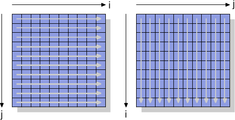

# 6. 程式設計師能做些什麼？

在前面幾節的描述之後，無疑地，程式設計師有非常非常多——正向或者負向地——影響程式效能的機會。而這裡僅討論與記憶體有關的操作。我們將會全面地解釋這些部分，由最底層的物理 RAM 存取以及 L1 快取開始，一路涵蓋到影響記憶體管理的 OS 功能。

## 6.1. 繞過快取

當資料被產生、並且沒有（立即）被再次使用時，記憶體儲存（store）操作會先讀取完整的快取行（cache line）然後修改快取資料，這點對效能是有害的。這個操作會將可能再次用到的資料踢出快取，以讓給那些短期內不會再次被用到的資料。尤其是像矩陣——它會先被填值、接著才被使用——這類大資料結構。在填入矩陣的最後一個元素前，第一個元素就會因為矩陣太大被踢出快取，導致寫入快取喪失效率。

對於這類情況，處理器（processor）提供了對*非暫存（non-temporal）*寫入操作的支援。這個情境下的非暫存指的是資料在短期內不會被使用，所以沒有任何快取它的理由。這些非暫存的寫入操作不會先讀取快取行然後才修改它；反之，新的內容會被直接寫進記憶體。

這聽來代價高昂，但並不是非得如此。處理器會試著使用合併寫入（write-combining，見 3.3.3 節）來填入整個快取行。若是成功了，那麼記憶體讀取操作是完全不必要的。如 x86 以及 x86-64 架構，gcc 提供了若干內建函數：

```c
#include <emmintrin.h>
void _mm_stream_si32(int *p, int a);
void _mm_stream_si128(int *p, __m128i a);
void _mm_stream_pd(double *p, __m128d a);
#include <xmmintrin.h>
void _mm_stream_pi(__m64 *p, __m64 a);
void _mm_stream_ps(float *p, __m128 a);
#include <ammintrin.h>
void _mm_stream_sd(double *p, __m128d a);
void _mm_stream_ss(float *p, __m128 a);
```

一次處理大量資料是最有效率地使用這些指令的情況。資料從記憶體載入、經過一或多步處理、而後寫回記憶體。資料「流（stream）」經處理器，這些指令便得名於此。

記憶體位置必須各自對齊至 8 或 16 位元組。在使用多媒體擴充（multimedia extension）的程式碼中，也可以用這些非暫存的版本替換一般的 `_mm_store_*` 指令。我們並沒有在 A.1 節的矩陣相乘程式中這麼做，因為寫入的值會在短時間內被再次使用。這是串流指令無所助益的一個例子。6.2.1 節會更加深入這段程式碼。

處理器的合併寫入緩衝區（buffer）可以將部分寫入快取行的請求延遲一小段時間。一個接著一個執行所有修改單一快取行的指令，以令合併寫入能真的發揮功用通常是必要的。以下是一個如何實踐的例子：

```c
#include <emmintrin.h>
void setbytes(char *p, int c)
{
  __m128i i = _mm_set_epi8(c, c, c, c,
                           c, c, c, c,
                           c, c, c, c,
                           c, c, c, c);
  _mm_stream_si128((__m128i *)&p[0], i);
  _mm_stream_si128((__m128i *)&p[16], i);
  _mm_stream_si128((__m128i *)&p[32], i);
  _mm_stream_si128((__m128i *)&p[48], i);
}
```

假設指標 `p` 被適當地對齊，呼叫這個函式會將指向的快取行中的所有位元組設為 `c`。合併寫入邏輯會看到四個生成的 `movntdq` 指令，並僅在最後一個指令被執行之後，才對記憶體發出寫入命令。總而言之，這段程式不僅避免了在寫入前讀取快取行，也避免快取被並非立即需要的資料污染。這在某些情況下有著巨大的好處。一個經常使用這項技術的例子即是 C 函式庫中的 `memset` 函數，它在處理大塊記憶體時應該要使用類似於上述程式的作法。

某些架構提供了專門的解法。PowerPC 架構定義了`dcbz` 指令，它能用以清除整個快取行。這個指令不會真的繞過快取，因為快取行仍會被分配（allocate）來存放結果，但沒有任何資料會從記憶體被讀出來。這相比於非暫存儲存指令更加受限，因為快取行只能全部被清空而污染了快取（在資料為非暫存的情況），但其不需合併寫入邏輯來達到這個結果。

為了一探非暫存指令的運作，我們將觀察一個用以測量矩陣——由一個二維陣列所組成——寫入效能的新測試。編譯器將矩陣置放於記憶體中，以令最左邊的（第一個）索引指向擁有所有元素的行（row），它們在記憶體中是被連續置放的。右邊的（第二個）索引指向一行中的元素。測試程式以兩種方式迭代（iterate）矩陣：第一種是在內部迴圈增加列（column）號，第二種是在內部迴圈增加行號。這代表其行為如圖 6.1 所示。



我們測量了初始化一個 3000 × 3000 矩陣所花的時間。為了觀察記憶體的表現，我們採用不會使用快取的儲存指令。在 IA-32 處理器上，「非暫存提示（non-temporal hint）」即被用在於此。作為比較，我們也測量了一般的儲存操作。結果見於表 6.1。

<figure>
  <table>
    <tr>
      <th rowspan="2"></th>
      <th colspan="2">內部迴圈增加</th>
    </tr>
    <tr>
      <th>行</th>
      <th>列</th>
    </tr>
    <tr>
      <td>一般</td>
      <td>0.048s</td>
      <td>0.127s</td>
    </tr>
    <tr>
      <td>非暫存</td>
      <td>0.048s</td>
      <td>0.160s</td>
    </tr>
  </table>
  <figcaption>表 6.1：矩陣初始化計時</figcaption>
</figure>

對於使用快取的一般寫入操作，我們觀察到預期中的結果：若是記憶體被循序地使用，我們會得到比較好的結果，整個操作費了 0.048s，相當於 750MB/s，幾近於隨機存取的情況卻花了 0.127s（大約 280MB/s）。這個矩陣已經大到令快取沒那麼有效了。

